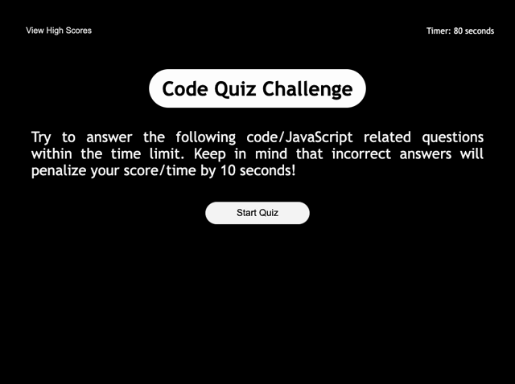

# code-quiz
# Purpose
A timed coding-based multiple choice quiz. 
* Users are given 80 seconds to answer 4 multiple choice questions based on the fundamentals of JavaScript.
    * When a user answers a question, they are presented with another question.
    * When users answers a question incorrectly 10 seconds are subtracted from the clock.
* The game is over when the timer reaches zero or the user answers all questions. 
    * Users can save their initials and score to the "high scores" page upon completion. 

## Made With
* HTML
* CSS
* JavaScript

## Website
https://jessica-calderon.github.io/code-quiz/

## Website Screenshot

## Contribution 
### Made by Jessica E. Calderon
